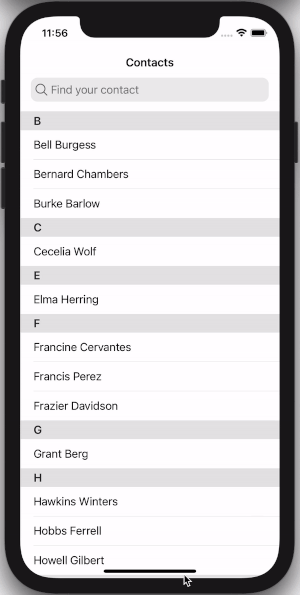

# Ionic Autocomplete Searchbar

This template shows how to use Ionic to create a text input that acts as an autocomplete input that filters a list of items.
It uses a contacts json file to load its items to the app and shows it in a list on the main view.
The autocomplete input let you filter the contacts list by name.
It's inspired by the Telegram and Whatsapp UX.



## Getting Started

To begin using this template, choose one of the following options to get started:
* Clone the repo: `git clone https://github.com/larixdeveloper/ionic-autocomplete-searchbar.git`

## Project Structure

```
.
   ├── src
   │   ├── app                    # This folder contains global modules and styling
   │   ├── assets                 # This folder contains images and the *contacts.json*
   |   ├── ...
   └── ...                        # Generic Ionic files
```

## Start the project
The project is started with the regular ionic commands.

1. Run `npm install` to install all dependencies.
2. Run `ionic serve` to start the development environment in the browser or run `npx cap open ios` to open XCode and run the app with iOS.


## Copyright and License

Copyright 2021 Lorenzo Laricchia - LARIX. Code released under the [MIT](https://opensource.org/licenses/MIT) license.